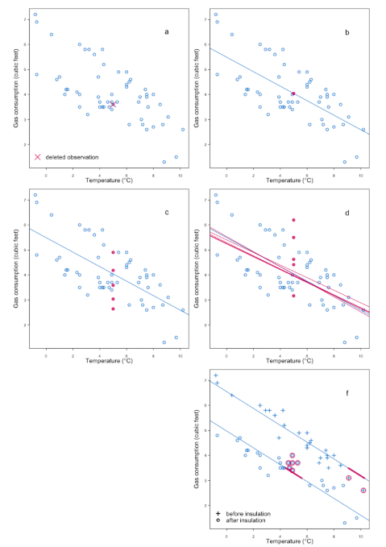

```{r setup, include=FALSE}
knitr::opts_chunk$set(echo = FALSE)
library(mice)
library(tidyverse)
library(haven)
library(lme4)
library(broom.mixed)
library(meta)
library(dplyr)
library(naniar)
library(tidymodels)
library(gtsummary)
source("R scripts/Functions.R")
source("R scripts/VITAL data formats.R")
source("R scripts/Acupuncture data formats.R")
source("R scripts/Summary analysis.R")
source("R scripts/Category time analysis.R")
source("R scripts/Continuous time analysis.R")
source("R scripts/Different Imputation Method.R")
source("R scripts/Sensitive Analysis.R")
```

# Recapitulation

## Missing Data

Missing data is defined as data that has not been stored for a variable in the observation of interest. A systematic review of articles regarding 62 studies found that:

- 44% did not report missing data 
- 69% did not report how missing data was handled

This shows how missing data is a topic that is often negected even though it can cause biased results when hadled inappropriately. 

## Missingness Mechanisms 

- Missing Completely At Random: $$P(R = 1 \mid Y, X) = P(R = 1)$$
- Missing At Random: $$P(R = 1 \mid Y, X) = P(R = 1 \mid X)$$
- Missing Not At Random: $$P(R = 1 \mid Y, X) \ne P(R = 1 \mid X)$$
- We can never confirm these assumptions but Little's MCAR Test can rule out the MCAR assumption

# Our Datasets 

## Treatment of Acupuncture on Headache 

- RCT to determine the effect of acupuncture on migraine against a placebo

```{r}
acu_wide_miss_plot
```


## Treatment of Vitamin D and Fish Oil on Knee Pain

- 2x2 RCT to compare effect of vitamin D and fish oil on knee pain

```{r}
vital_wide_miss_plot
```

# Approaches to Missing Data 

## Complete Case Analysis 

- Only analyse the cases where there are no missing data in any variables, this is popular due to its swift application. 
- Cases with missing data are ignored

Limitations: 

- May be valid when data is MCAR only
- Introduces selection bias 
- Reduces statistical power 

## Single Imputation

- Replaces missing data with a single value 
- Last observation carried forward: the missing value is replaced by the preceding observed measure,
- Mean observation carried forward: the missing value is replaced by the mean value of all observed measure.  

Limitations:

- Reduces variability in the results 
- Assumes data is MCAR

## Maximum Likelihood Estimation

- Linear Mixed Effects Model adjusts to missing data by using maximum likelihood estimation
- It uses all observed data to measure the treatment effect without needing to use complete cases only. 
- This is suitable for when the outcome variable has NA values
- Suitable for MAR and MCAR

## Multiple Imputation Using Chained Equations 

- All missing data are imputed with values derived from observed data to act as placeholders
- Starting with variable $x_i$ that contains missing data, remove the place holders in this variable 
- Regress $x_i$ on remaining covariates $x_{i+1}$, $x_{i+2}$,..., $x_{i+p}$
- $x_i = \beta_0 + \beta_1 x_{i+1} + \beta_2 x_{i+2} + ...+\beta_p x_{i+p} + \varepsilon$
- This model is predicts the missing values in $x_i$ if it were observed, these steps are repeated for $x_{i+1}$, $x_{i+2}$,..., $x_{i+p}$
- We can use this process to create $m$ data sets with imputed values, typically 5 or 10 suffices. 

## MICE function

| Method         | Definition                              |
|----------------|-----------------------------------------|
| "pmm"          | Predictive mean matching                |
| "norm.nob"     | Linear regression, ignoring model error |
| "norm"         | Bayesian linear regression              |
| "norm.predict" | Linear regression, predicted value      |
| "sample"       | Random sample from $Y_O$                |
| "midastouch"   | Weighted predictive mean matching       |


## Sensitivity Analysis

This estimates the treatment effect when data is analysed under different missingness assumptions. The $δ-Adjustment$ approach shows how the treatment effect changes when the data is missing not at random. 


## Estimating Treatment Effects 

- Simple Linear Regression Models: Outcome is modelled as a straight line 
- Linear Mixed Effects Models: Extends the linear regression model by accounting for individual variability

We use use both types of modelling on the different types of imputed data sets to see how the treatment effect estimates change.   

## Treatment Effect of Acupuncture 

When treating time as continuous:

Estimand: Difference in mean headache score $pk_score$ at final time point of 12 months 

Linear Regression Model:
$\small\text{pk_score} = \beta_0 + \beta_1 \text{group} + \beta_2  \text{time} + \beta_3  (\text{group}  \text{time}) + \beta_4  \text{pk1} + \varepsilon$

Linear Mixed Effects model:
$\small\text{pk_score}_{ij} = \beta_0 + \beta_1 \text{group}_i + \beta_2  \text{time}_{ij} + \beta_3 (\text{group}_i  \text{time}_{ij}) + \beta_4 \text{pk1}_i + b_{0i} + \varepsilon_{ij}$

## Treatment Effect of Acupuncture 

Treating time as categorical

Estimand: Mean difference in headache score $pk5$ 

Linear Regression Model:
$\small\text{pk5} = \beta_0 + \beta_1  \text{group} + \beta_2 \text{pk1} + \varepsilon$

Linear Mixed Effects:
$\small\text{pk5}_{ij} = \beta_0 + \beta_1  \text{group}_i + \beta_2 \text{pk1}_i + \beta_3  \text{pk2}_{ij} + b_{0i} + \varepsilon_{ij}$

## Analysis summary

We have perform the following analysis.
For simplicity, the only covariates included here are the group and outcome baseline.

1. Combination of different parameters
  - Simple linear regression or LME
  - Different imputation method
  
2. Changing estimands

3. Different multiple impuation methods

4. Sensitive analysis (shifting)

## Combination of different parameters - summary

|Abbreviations|Method|SLR/MLE|SI/MI|MI Method|
|---|---|---|---|---|
|CAA|Complete case analysis|SLR|N/A|N/A|
|LOCF|Last observation carry forward|SLR|SI|Last observation|
|MOCF|Mean observation carry forward|SLR|SI|Mean observation|
|LME|LME only|LME|N/A|N/A|
|MI|MI only|SLR|MI|Predictive mean method|
|LME+MI|LME + MI|LME|MI|Predictive mean method|

## Combination of different parameters - acu result

```{r}
acu_plot_categorical
```

Linear Regression Model:
$\small\text{pk5} = \beta_0 + \beta_1  \text{group} + \beta_2 \text{pk1} + \varepsilon$

Linear Mixed Effects:
$\small\text{pk5}_{ij} = \beta_0 + \beta_1  \text{group}_i + \beta_2  \text{pk2}_{ij} + b_{0i} + \varepsilon_{ij}$


## Combination of different parameters - vital result

```{r}
vital_plot_categorical
```

Linear Regression Model:
$\small\text{pain_yr4} = \beta_0 + \beta_1  \text{group} + \beta_2 \text{pain_baseline} + \varepsilon$

Linear Mixed Effects:
$\small\text{pain_yr4}_{ij} = \beta_0 + \beta_1  \text{group}_i + \beta_2  \text{pain_baseline}_{ij} + b_{0i} + \varepsilon_{ij}$

## Changing estimands - summary

In previous session, the estimand is:

**The mean difference of outcome at the end of study** between groups
Linear Regression Model:
$\small\text{outcome_end} = \beta_0 + \beta_1  \text{group} + \beta_2 \text{outcome_baseline} + \varepsilon$

In this session we are testing if we change the estimand to:
**The difference of outcome change rates over time** between groups
Linear Regression Model:
$\small\text{outcome_end} = \beta_0 + \beta_1  \text{group} + \beta_2 \text{outcome_baseline} + \beta_3 \text{time} + \varepsilon$

## Changing estimands - result

```{r}
acu_plot_compare
vital_plot_compare
```

Purple: Before changing estimand
Green: After changing estimand

## Different imputation methods

| Imputation Mthods                       |
|-----------------------------------------|
| Linear regression predicted value      |
| Linear regression predicted value + noise|
| Random parameters |
| Predictive mean matching                |
| Weighted predictive mean matching       |
| Bayesian classification                 |

## Different imputation methods




## Different imputation methods - Result

```{r}
acu_plot_imp
vital_plot_impt
```

## Sensitive analysis

```{r}
delta_compare_acu
delta_combined_fishoil_plot
delta_combined_vitd_plot
```

## Conclusion

So far, for both data sets. There is no significant impact observed when we apply different missing data analysis methods.

Note at the stage we haven't include covaraites yet. Which might not be a big change for the acupuncture data set, as there are no missing value in those covariates.

But the VITAL data set have missing value in various covariates in different extents. Also have more data collection tiem points. So we expect to see more impact between methods.

